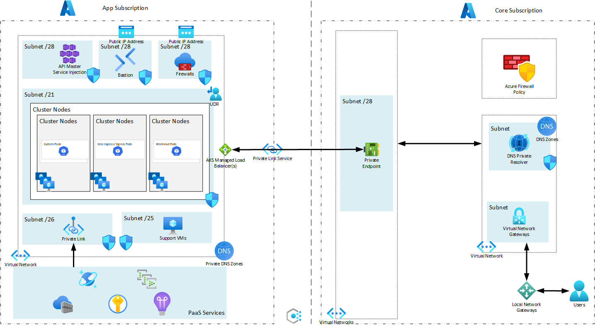

# Overview

This repository is a demonstration of how to build a locked sandbox environment in Azure leveraging Private Link Scope. It is currently a work in progress

## Required Existing Resources and Configuration
Component | Usage
--------------- | --------------- 
| Two Azure Subscriptions | Application Subscription and Core Subscription |
| Identity granted Owner permissions over each subscription |
| Azure Virtual Network (Core) | A subnet for Private Endpoints |
| Azure VPN Gateway | |
| Azure Firewall Policy | [Required Rules](https://github.com/briandenicola/kubernetes-cluster-setup/blob/main/infrastructure/prereqs/azuredeploy.template.json)
| Private DNS Zones (attached to Core Vnet) | privatelink.azurecr.io |


## Components
Component | Usage
------ | ------
Azure Kubernetes Service | Container Orchestration Runtime Platform  
Azure Cosmos DB | Data storage for application 
Azure Key Vault | Secret store 
Azure Event Hubs | Kafka equivalent resource in Azure
Azure Container Registry | Azure Container Registry for containers
Azure Virtual Network  | Azure Virtual Network for all resources and private endpoints
Azure Private Link Service | Exposes AKS Ingress Control back to your Azure Core
# Architecture Diagram


# Infrastructure Deployment 
## Build Environment
```bash
    vi ./infrastructure/azure.tfvars
    #firewall_policy_name                         = "bjdproxy-southcentral-policy"
    #firewall_policy_rg_name                      = "Core_Firewall_RG"
    #core_subscription                            = "43a071dd-5b86-475f-960b-59f814e4f070"
    #core_private_endpoint_virutalnetwork_rg_name = "Core_Network_RG"
    #core_private_endpoint_virutalnetwork_name    = "BJD-Core-VNet-001"
    #core_dns_rg_name                             = "Core_DNS_RG"
    #core_private_endpoint_rg_name                = "Core_PrivateEndpoints_RG"

    az login --scope https://graph.microsoft.com/.default #Code requires AAD permissions 
    task up
```
## Destory Environment
```bash
    az login --scope https://graph.microsoft.com/.default
    task down
```

## Run Commands
```bash
    task run -- "kubectl get nodes" 
    task: [run] az aks command invoke -g monkey-14304_rg -n monkey-14304-aks --command 'kubectl get nodes'
    command started at 2023-05-05 15:08:35+00:00, finished at 2023-05-05 15:08:36+00:00 with exitcode=0
    NAME                              STATUS   ROLES   AGE    VERSION
    aks-default-86141613-vmss000000   Ready    agent   134m   v1.26.3
    aks-default-86141613-vmss000001   Ready    agent   134m   v1.26.3
    aks-default-86141613-vmss000002   Ready    agent   134m   v1.26.3
    aks-default-86141613-vmss000003   Ready    agent   108m   v1.26.3
    aks-default-86141613-vmss000004   Ready    agent   64m    v1.26.3

    task run -- "kubectl get pods -n bookstore" 
    task: [run] az aks command invoke -g monkey-14304_rg -n monkey-14304-aks --command 'kubectl get pods -n bookstore'
    command started at 2023-05-05 15:09:26+00:00, finished at 2023-05-05 15:09:27+00:00 with exitcode=0
    NAME                              READY   STATUS    RESTARTS   AGE
    details-v1-bdb97665b-ptqn4        2/2     Running   0          106m
    productpage-v1-6f769fcbc6-qxlww   2/2     Running   0          106m
    ratings-v1-5744f4c948-ll89x       2/2     Running   0          106m
    reviews-v1-98c4d66d-m68kl         2/2     Running   0          106m
    reviews-v2-58778c5cb-4h8jp        2/2     Running   0          106m
    reviews-v3-85f56ccb56-2dtd9       2/2     Running   0          106m
```

# Application Deployment
1. Create directory under ./cluster-config
1. Copy deployment YAML files under newly created directory
1. Update kustomization.yaml with newly created directory
1. Commit back to git repository

# Bastion Connectivity
* _TBD_