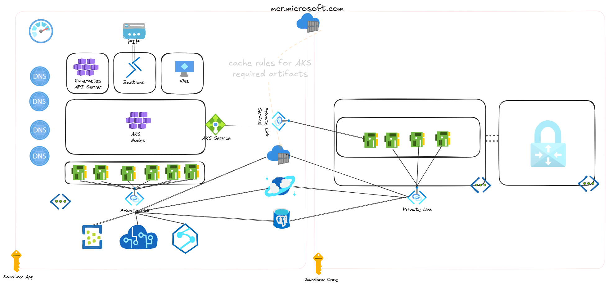

# Overview

This repository is a demonstration of how to build a locked sandbox environment in Azure leveraging Private Link Scope. The environment is designed to be a secure environment for developers to build and deploy applications. The environment is designed to be locked down to only allow access to the Azure Core and the Azure Core's resources.  

* The AKS cluster is deployed to take advantage of the new isolated deployment model, where a managed ACR caches containers from mcr.microsoft.com - removing the need for the AKS cluster to have internet access.
* Each subnet in the application stamp has been configure to disable outbound access.
* Private Link Service is used to expose the AKS Ingress Controller to your Azure Core
* Private Link Service is used to expose the Azure Container Registry to your Azure Core

## Deployed Components for Developers
Component | Usage
------ | ------
Azure Kubernetes Service | Container Orchestration Runtime Platform  
Azure Cosmos DB | Data storage for application 
Azure Event Hubs | Kafka equivalent resource in Azure
Azure Container Registry | Azure Container Registry for containers
Azure Virtual Network  | Azure Virtual Network for all resources and private endpoints
Azure Private Link Service | Exposes AKS Ingress Control back to your Azure Core

# Architecture Diagram


# Infrastructure Deployment 
## Build Environment
```bash
    vi ./infrastructure/azure.tfvars
    #core_subscription = "43a071dd-5b86-475f-960b-59f814e4f070"
    #dev_subscription  = "1fc91beb-c262-400a-a4e0-b5eec229e46e"
    #deploy_jumpbox    = false
    #deploy_cosmos_db  = true
    #deploy_event_hub  = false
    #node_count        = 3
    #node_sku          = "Standard_D4s_v5"

    az login --scope https://graph.microsoft.com/.default #Code requires AAD permissions 
    task up
```
## Destory Environment
```bash
    az login --scope https://graph.microsoft.com/.default
    task down
```

# Application Deployment
## CI/CD Overview


### Lifecycle
1. Developer checkouts out branch in code repository using Github Codespaces.
1. Developer updates code and develops againist a dedicated mini-cluster either in the Codespace or against AKS in Azure
    * This [repository](https://github.com/briandenicola/codespaces-developer-demo) shows an example of this
1. Developer checks in Code
1. Azure Container Registry has a Build Task configured to monitor for code changes
1. Azure Container Registry builds the application container
1. Developer Updates Helm chart with new container version
1. Flux on the Sandbox AKS cluster monitors for updates for updates to the Helm chart and deploys updated code to the cluster

# Application Troubleshooting 
##  Azure Monitor
* Diagnostic Logging for each Azure resource will be sent to the Sandbox's Log Analtyics resource 
* AKS Cluster Insights is configured to ship node and pod utilization as well as container stdout/stderr to the Sandbox Log Analtyics resource
* Application should include AppInsights SDK or Otel SDK to send application logs to the Sandbox's AppInsights resource
* The environment can be updated to incldue Azure Manage Grafana and Azure Managed Prometheus 

## AKS Run Invoke Command
* The Azure Cli AKS subcommand has the ability to run commands on a private AKS cluster without having direct connectivity.  
* This can be used for one-off commands including viewing logs
```bash
    task run -- "kubectl get nodes" 
    task: [run] az aks command invoke -g monkey-14304_rg -n monkey-14304-aks --command 'kubectl get nodes'
    command started at 2023-05-05 15:08:35+00:00, finished at 2023-05-05 15:08:36+00:00 with exitcode=0
    NAME                              STATUS   ROLES   AGE    VERSION
    aks-default-86141613-vmss000000   Ready    agent   134m   v1.26.3
    aks-default-86141613-vmss000001   Ready    agent   134m   v1.26.3
    aks-default-86141613-vmss000002   Ready    agent   134m   v1.26.3
    aks-default-86141613-vmss000003   Ready    agent   108m   v1.26.3
    aks-default-86141613-vmss000004   Ready    agent   64m    v1.26.3

    task run -- "kubectl get pods -n bookstore" 
    task: [run] az aks command invoke -g monkey-14304_rg -n monkey-14304-aks --command 'kubectl get pods -n bookstore'
    command started at 2023-05-05 15:09:26+00:00, finished at 2023-05-05 15:09:27+00:00 with exitcode=0
    NAME                              READY   STATUS    RESTARTS   AGE
    details-v1-bdb97665b-ptqn4        2/2     Running   0          106m
    productpage-v1-6f769fcbc6-qxlww   2/2     Running   0          106m
    ratings-v1-5744f4c948-ll89x       2/2     Running   0          106m
    reviews-v1-98c4d66d-m68kl         2/2     Running   0          106m
    reviews-v2-58778c5cb-4h8jp        2/2     Running   0          106m
    reviews-v3-85f56ccb56-2dtd9       2/2     Running   0          106m

    task run -- "kubectl logs todoapi-84664fcfc8-qnxpg"
    task: [run] az aks command invoke -g monkey-14304_rg -n monkey-14304-aks --command "kubectl logs todoapi-84664fcfc8-qnxpg"
    command started at 2023-05-08 17:28:15+00:00, finished at 2023-05-08 17:28:16+00:00 with exitcode=0
    info: todoapi[0]
        Application is ready to run.
    warn: Microsoft.AspNetCore.Server.Kestrel[0]
        Overriding address(es) 'http://+:80'. Binding to endpoints defined via IConfiguration and/or UseKestrel() instead.
    info: Microsoft.Hosting.Lifetime[14]
        Now listening on: https://0.0.0.0:8443
    info: Microsoft.Hosting.Lifetime[0]
        Application started. Press Ctrl+C to shut down.
    info: Microsoft.Hosting.Lifetime[0]
        Hosting environment: Production
    info: Microsoft.Hosting.Lifetime[0]
        Content root path: /app/
    info: Todos.TodoController[0]
```

## Temporary Administator Machine
* At times, VM resources maybe required to do deep dive troubleshooting.  
* This can be accessed through a free Azure Bastion Developer SKU.  You can SSH into a Linux machine via the Azure Portal to troubleshoot
